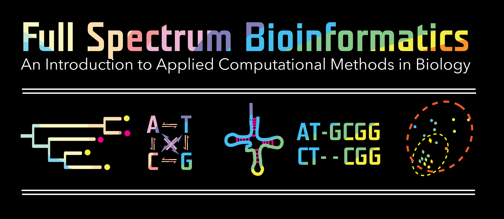

# full_spectrum_bioinformatics

This text is currently in early prototype status. 

Chapters with content you can view are linked below:

Chapter 1. Foreword
Chapter 2. Introduction
Chapter 3. The Commandline
Chapter 4. Exploring Python
Chapter 5. [Project Design](./05_project_design/project_design.ipynb) 
Chapter 6. Biological Sequences
Chapter 7. Tabular 'Omics Data
Chapter 8. Alignment and Phylogeny
Chapter 9. Visualization
Chapter 10. Simulation
Chapter 11. Statistics
Chapter 12. Multivariate methods
Chapter 13. Presenting Research
Chapter 14. Polishing and Publishing
Appendix A - Data Sources for Bioinformatics Projects
Appendix B - Project Specifications 
